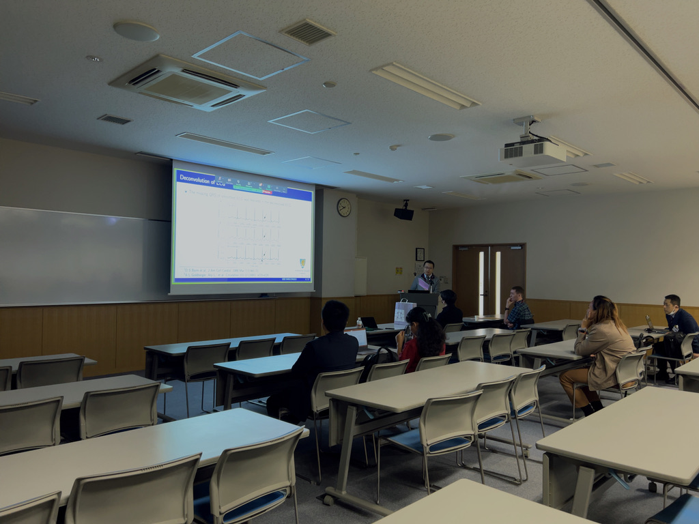

學術活動
=====

.. _biography:

林醫師的研究主要集中在以下幾個領域：

* 醫學影像中的先進數值分析技術。
* 醫學影像處理中的計算方法與演算法開發。
* MRI影像重建與優化技術。
* 診斷放射學中醫學物理的應用。
* 先進的臨床影像分析與計算建模技術。
* 動態主動脈造影。
* 人工智慧應用與風險。

您可以在Google Scholar、IEEE Xplore或PubMed等找到他的相關發表研究。

.. image:: ../media/talk.jpeg
   :align: center
   :alt: talk

<Powered by ChatGPT>

